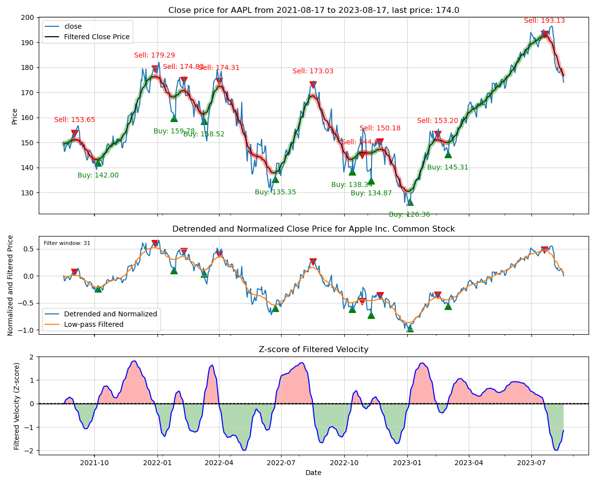

# Stock Analysis and Trading Strategy Generator

This Python program is designed to analyze stock data and generate trading strategies based on trend analysis and filtering techniques. It utilizes historical data, computes trends, applies filters, and identifies buy/sell actions.

## Features

- Fetches OHLC (Open, High, Low, Close) data for a given stock symbol
- Computes linear trend lines and detrends the close prices
- Normalizes and filters the detrended data using a Hanning filter
- Calculates the filtered velocity and its z-score
- Generates buy and sell actions based on the z-score threshold
- Plots the close price, detrended data, filtered data, and z-score of filtered velocity
- Visualizes buy and sell actions on the plots

## Requirements

- Python 3.x
- `numpy`
- `pandas`
- `matplotlib`
- `pandas_market_calendars`
- `scipy`
- `argparse`
- `alpaca_trade_api`

## Usage

1. Install the required dependencies: `pip install -r requirements.txt`
2. Set up API keys for the Alpaca API by setting environment variables: `APCA_API_KEY_ID` and `APCA_API_SECRET_KEY`.
3. Run the program with the desired command-line arguments. For example:

```
python main.py -s AAPL -n 504 -w 31 -sd 0.01 -t Day
```
- `-s/--symbol`: Stock symbol to analyze
- `-n/--ndays`: Number of trading days to fetch data for
- `-w/--window`: Window size for the Hanning filter
- `-sd/--std_dev`: Number of standard deviations for the z-score threshold
- `-t/--timeframe`: Timeframe for the OHLC data (Day or Minute)

## Examples

- Fetch and analyze 504 trading days of AAPL stock data with a Hanning filter window of 31 and a z-score threshold of 0.01:

```
python main.py -s AAPL -n 504 -w 31 -sd 0.01 -t Day
```


AAPL  last action was Sell on 2023-07-07 (   1 trading-days ago) at a price of  190.680 last price  188.610 percent change    -1.086

Here is AAPL at a later time with the same command-line parameters:



AAPL  last action was Sell on 2023-07-20 (  20 trading-days ago) at a price of  193.130 last price  173.770 percent change   -10.024

- Fetch and analyze 504 trading days of STRL stock data with a default Hanning filter window size and a z-score threshold of 0.01:

```
python main.class.py -s STRL
```


STRL  last action was Buy  on 2023-04-18 (  86 trading-days ago) at a price of   36.830 last price   77.650 percent change   110.834

- Fetch and analyze 5000 trading minutes of STRL stock data from last 6 trading days with a default Hanning filter window size and a z-score threshold of 0.01:


```
python main.class.py -s STRL -t Minute -n 6
```


STRL  last action was Buy  on 2023-08-18:13:35 (  335 samples ago) at a price of   75.643 last price   77.650 percent change     2.654

## License

This project is licensed under the [MIT License](LICENSE).
